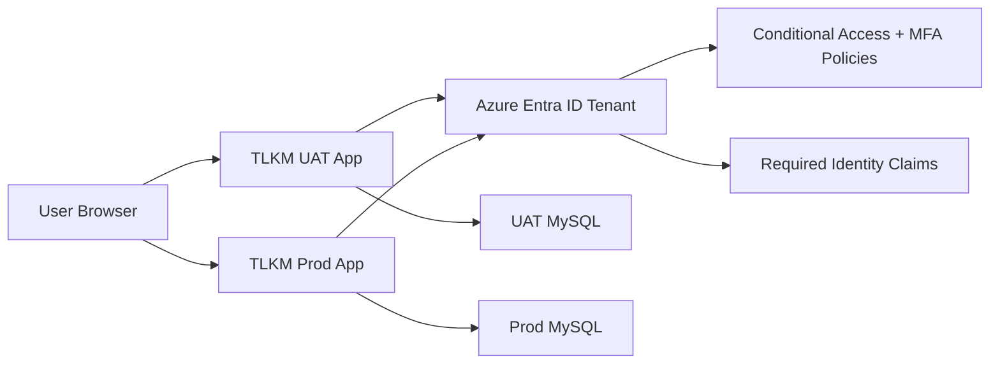
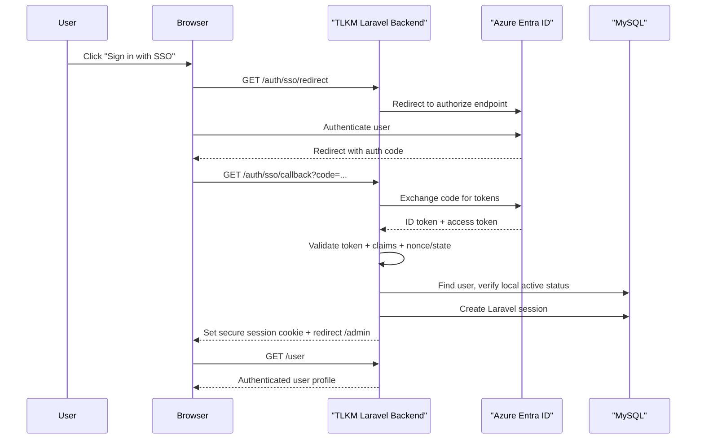

# TLKM Confirmations: Azure Entra ID SSO Architecture

Date: February 22, 2026  
Audience: IT Department, Security, Infrastructure, Application Engineering  
System: TLKM Intercompany Confirmations (`/Users/conciseflow/Sites/tlkm-comfirmations`)

## 1. Purpose

This document defines the target architecture to introduce Single Sign-On (SSO) using Microsoft Azure Entra ID for the TLKM Confirmations system. It is intended as a submission artifact to begin IT onboarding, security review, and platform enablement.

Authentication model boundary:

- Entra ID is used to authenticate user identity and account active status.
- TLKM remains the source of truth for user access/roles/permissions inside the application.

## 2. Current State (As-Is)

The application is a Laravel 12 + React SPA with session-based authentication.

- Login endpoint: `POST /login` (`/Users/conciseflow/Sites/tlkm-comfirmations/routes/web.php`)
- Logout endpoint: `POST /logout` (`/Users/conciseflow/Sites/tlkm-comfirmations/routes/web.php`)
- Current user endpoint: `GET /user` (`/Users/conciseflow/Sites/tlkm-comfirmations/routes/web.php`)
- Session guard: Laravel `web` guard (`/Users/conciseflow/Sites/tlkm-comfirmations/config/auth.php`)
- Session persistence: database-backed sessions (`/Users/conciseflow/Sites/tlkm-comfirmations/config/session.php`)
- Authorization: Spatie roles + Laravel policies (`/Users/conciseflow/Sites/tlkm-comfirmations/app/Models/User.php`)
- Existing UI has an SSO button placeholder: `/Users/conciseflow/Sites/tlkm-comfirmations/resources/js/pages/Login.jsx`

## 3. Target State (To-Be)

Implement OpenID Connect (OIDC) Authorization Code flow with Azure Entra ID, while keeping Laravel server-side sessions as the application session model.

This design applies to both environments:

- UAT (non-production validation environment)
- Production (live user environment)

High-level:

1. User clicks `Sign in with SSO`.
2. Browser is redirected to Entra ID authorize endpoint.
3. Entra ID authenticates user (MFA/Conditional Access enforced by IT).
4. Entra ID redirects back to TLKM callback endpoint with authorization code.
5. Backend exchanges code for tokens securely.
6. Backend validates token claims, confirms identity, and checks whether that user exists and is active in TLKM.
7. Laravel creates session cookie and grants access to existing protected routes.

## 4. Architecture Overview

Trust boundaries:

- External IdP boundary: Browser <-> Entra ID.
- Application boundaries: Browser <-> TLKM UAT and Browser <-> TLKM Prod (HTTPS only).
- Internal data boundaries: UAT app <-> UAT DB, Prod app <-> Prod DB.
- No shared sessions, cookies, or credentials between UAT and Prod.

## 5. Proposed SSO Integration Pattern

### 5.1 Protocol and Session Model

- Protocol: OIDC Authorization Code (confidential server-side client).
- Application session: Laravel cookie/session (existing model remains).
- Token storage: tokens validated server-side; no token persistence in browser local storage.

### 5.2 Proposed Authentication Endpoints

Add routes:

- `GET /auth/sso/redirect`  
  Starts OIDC flow and redirects to Entra authorize URL.
- `GET /auth/sso/callback`  
  Handles code exchange, claim validation, local user validation, and login.
- `POST /auth/sso/logout` (optional but recommended)  
  Logs user out locally and optionally initiates Entra logout.

Both UAT and Prod expose the same route pattern; only domain and Entra app credentials differ.

### 5.3 User Identity Mapping Strategy

Use Entra identity claims to perform local user lookup and login decision:

- Required identity claims: `tid`, `oid`, and one login identifier (`preferred_username` or `upn` or `email`).
- Recommended local linking: store `oid` + `tid` against TLKM user record for stable identity.
- Lookup key for initial onboarding compatibility: normalized email/UPN.

Login decision rules:

- If Entra authentication succeeds and TLKM user exists and is active -> allow login.
- If Entra authentication succeeds but TLKM user does not exist -> deny login and return controlled message.
- If Entra authentication succeeds but TLKM user is inactive/disabled locally -> deny login.

Rationale: Entra confirms identity; TLKM governs application access.

### 5.4 Authorization Boundary (No Entra Role Dependency)

Current TLKM roles:

- `group_admin`
- `company_admin`
- `company_user`
- `company_preparer`
- `company_reviewer`

Important:

- TLKM does not depend on Entra groups, Entra app roles, or role claims for authorization.
- Authorization remains fully local via TLKM database roles/policies.
- Entra role/group claims are optional and not required for SSO launch.

## 6. Sequence Flow

## 7. Security and Compliance Requirements

Mandatory controls:

- HTTPS only in all environments exposed to users.
- `SESSION_SECURE_COOKIE=true`, `HttpOnly=true`, `SameSite=Lax` (or stricter as validated).
- CSRF protection remains enabled for mutating routes.
- State + nonce validation in OIDC callback.
- Strict redirect URI allowlist in Entra app registration.
- Principle of least privilege in Entra app permissions.
- Fail-closed behavior if claims are missing/invalid.
- Authentication audit logs retained (login success/failure, local user lookup outcome, deny reasons).

Optional controls (recommended):

- Restrict login to a single tenant (`tid` allowlist).
- Disable password login in production once SSO is stable.
- Add automated alerts for repeated SSO failures.

## 8. IT Department Inputs Required (Kickoff Checklist)

Priority message for IT:

- TLKM only needs Entra to authenticate identity and enforce account active status.
- TLKM does not require Entra role/group-based authorization for application access.
- TLKM authorization (roles, permissions, company scope) is managed entirely inside TLKM.

### 8.1 Entra Tenant and App Registration

IT to provide:

- Entra Tenant ID.
- Separate app registrations per environment (recommended):
  - `TLKM-Confirmations-UAT`
  - `TLKM-Confirmations-PROD`
- Client IDs:
  - UAT Client ID
  - Prod Client ID
- Separate credentials:
  - UAT client secret/certificate
  - Prod client secret/certificate (certificate preferred)
- Approved redirect URI(s):
  - UAT: `https://<uat-domain>/auth/sso/callback`
  - Prod: `https://<prod-domain>/auth/sso/callback`
- Approved logout URI (if single logout is required).
- ID token must include identity claims required for local lookup:
  - `tid`
  - `oid`
  - `preferred_username` or `upn` or `email`
- Confirmation whether UAT and Prod use:
  - same Entra tenant with separate app registrations, or
  - separate Entra tenants.
- No Entra group/app-role claim design is required for TLKM authorization.

### 8.2 Access Governance

IT to define:

- Source of truth for user employment/account lifecycle in Entra (enabled/disabled account state).
- Access request and approval workflow (joiner/mover/leaver process).
- SLA for disabling sign-in when user leaves (leaver control).

### 8.3 Security Policy Integration

IT to confirm:

- MFA requirement.
- Conditional Access policy scope (network/location/device constraints).
- Session sign-in frequency and token lifetime policy expectations.
- Logging destination/SIEM integration requirements.
- Whether UAT Conditional Access is relaxed for testing or mirrors production policy.

### 8.4 Networking and Platform

IT to confirm:

- Public DNS and TLS certificate readiness for both UAT and Prod domains.
- Firewall/proxy rules for outbound calls from app host to Microsoft identity endpoints.
- Time synchronization (NTP) on app hosts (critical for token validation).

## 9. Application Configuration Requirements

Planned new environment values per environment (names can be finalized during build):

- `AZURE_TENANT_ID`
- `AZURE_CLIENT_ID`
- `AZURE_CLIENT_SECRET` (or certificate reference)
- `AZURE_REDIRECT_URI`
- `AZURE_ALLOWED_TENANT_IDS` (if multi-tenant not allowed)

Environment separation requirement:

- UAT deployment must use only UAT values.
- Prod deployment must use only Prod values.
- Do not reuse UAT secret/certificate in Prod.
- Keep callback domains environment-specific.

Secret handling:

- No secrets in source control.
- Store secrets in approved secret manager/CI variable store.
- Rotate secrets per IT policy.

## 10. Delivery Plan

Phase 1: Foundation

- Register Entra application.
- Confirm required identity claims and callback URIs.
- Add SSO routes and backend OIDC integration.

Phase 2: Local Access Validation

- Implement local user resolution and local active-status checks after Entra authentication.
- Add fail-closed checks and audit logging for unknown/inactive users.

Phase 3: UAT and Security Validation

- Execute test cases for login, logout, access denial, role changes, leaver disablement.
- Validate MFA and Conditional Access behavior.
- Obtain UAT sign-off from IT Security and Application Owner before Prod activation.

Phase 4: Production Rollout

- Cut over user groups.
- Monitor authentication logs and error rates.
- Optionally disable local password login.
- Keep UAT active for regression testing, isolated from Prod access and credentials.

## 11. Acceptance Criteria

The solution is accepted when:

- UAT SSO is functional end-to-end with approved test evidence.
- Prod SSO is functional end-to-end after UAT sign-off.
- Users can authenticate with Entra ID and access TLKM only when user exists and is active in TLKM.
- Unauthorized users are denied access with traceable logs.
- Session security controls are validated in production-like environment.
- Joiner/mover/leaver scenarios are proven in UAT.
- IT Security signs off on architecture and controls.

## 12. Open Decisions for IT + Engineering

- Unknown user handling in TLKM:
  - deny-only (recommended), or
  - controlled onboarding/provisioning process.
- Secret vs certificate credential for production client authentication.
- Whether local/password login remains enabled for break-glass accounts only.
- Single logout requirement (local-only logout vs Entra sign-out propagation).

## 13. Summary

Recommended approach is Azure Entra ID OIDC SSO integrated at backend level, preserving existing Laravel session architecture and authorization policies, with explicit dual-environment operation for UAT and Production. This minimizes application change while aligning authentication with enterprise identity, MFA, and centralized access governance.
