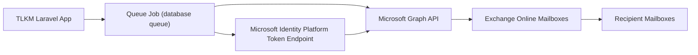

# TLKM Confirmations: Microsoft Graph App-Only Email Requirements for IT

Date: February 22, 2026  
Audience: IT Infrastructure, Messaging Team, Security, Application Support  
System: TLKM Confirmations (`/Users/conciseflow/Sites/tlkm-comfirmations`)

## 1. Purpose

This document defines what the TLKM application needs from IT to send outbound emails to users in UAT and Production using Microsoft Graph API (app-only).

Important scope boundary:

- This is app-only outbound email integration through Microsoft Graph.
- This is not related to SSO, Entra roles, or identity authorization.

## 2. Current Application State

Observed in current codebase:

- Mail transport is currently `log` (no real outbound delivery):
  - `/Users/conciseflow/Sites/tlkm-comfirmations/config/mail.php`
  - `/Users/conciseflow/Sites/tlkm-comfirmations/.env`
- Queue connection is `database`:
  - `/Users/conciseflow/Sites/tlkm-comfirmations/config/queue.php`
- Production container supervisor currently runs `php-fpm` and `nginx`, but no queue worker process:
  - `/Users/conciseflow/Sites/tlkm-comfirmations/docker/supervisord.conf`

Implication:

- Microsoft Graph app registration/permissions + queue worker operations are both required for reliable delivery.

## 3. Target Email Architecture

Recommended behavior:

- App sends email asynchronously via queue jobs.
- App obtains app-only token via client credentials flow.
- App sends using `POST /users/{id|userPrincipalName}/sendMail`.
- UAT and Prod are isolated (separate credentials and sender identity controls).

## 4. Integration Model (Fixed)

Required model:

- Microsoft Graph API `sendMail` with app-only token (no signed-in user context).

Reason:

- This aligns with the project direction and centralizes mail controls in Microsoft 365.

## 4.1 Clarification for IT: App Identity vs Mailbox Identity

The application uses two different identities:

- **App identity (required):** Entra app registration/service principal used for OAuth client-credentials token acquisition.
- **Mailbox identity (required):** Exchange mailbox that email is sent as (for example `tlkm-notify@company.com`).

What is **not** required:

- No interactive Microsoft 365 user login for the application itself.
- No password-based mailbox login from the app.

What is required:

- At least one approved sender mailbox in Exchange Online.
- App permission scope restricted so the app can send only as approved mailbox(es).

## 5. What the App Needs From IT

IT should provide the following for **UAT and Prod separately**.

### 5.1 Entra App Registration + Credentials

- App registration per environment (recommended):
  - `TLKM-Confirmations-Mail-UAT`
  - `TLKM-Confirmations-Mail-PROD`
- Tenant ID and Client ID for each app registration.
- App credential for each environment:
  - certificate (preferred for Prod), or
  - client secret (acceptable for UAT).
- Credential validity and rotation schedule.

### 5.2 Required Microsoft Graph Permissions

Minimum required permission:

- Microsoft Graph **Application** permission: `Mail.Send`
  - Display: `Send mail as any user`
  - Admin consent: **Required**

Important:

- Delegated permissions are not required for this app-only model.
- `Mail.Read`/`Mail.ReadWrite` are not required to send mail.

### 5.2.1 Mailbox Requirement

- IT must provide sender mailbox identity per environment (UAT/Prod).
- Shared mailbox is acceptable if aligned with IT policy.
- IT to confirm licensing and mailbox governance requirements for the chosen sender mailbox type.

### 5.3 Exchange Online Mailbox Scope Restriction (Security Critical)

By default, `Mail.Send` application permission is tenant-wide. IT must restrict scope to approved sender mailboxes.

Recommended control:

- Exchange Online **RBAC for Applications** with `Application Mail.Send` role scoped to approved mailbox set.

Fallback (legacy only, if RBAC for Applications is not available in tenant process yet):

- Exchange Online Application Access Policy.

IT to provide:

- List of approved sender mailboxes per environment.
- Confirmed scope enforcement model (RBAC for Applications preferred).
- Evidence that app cannot send as unapproved mailboxes.

### 5.4 Sender Identity and Policy

- Approved sender mailbox(es) per environment.
- Approved display name per environment.
- Approved `Reply-To` policy (if different from sender mailbox).
- Confirmation of organizational anti-spoofing policy handling for app-generated mail.

### 5.5 Security and Compliance Controls

- Outbound mail restrictions for UAT (recommended: test domains only, or approved test user list).
- Message retention/journaling requirements (if any).
- Malware/link scanning and DLP policies applied to app-generated mail.
- Secret/certificate storage policy and credential rotation schedule.

### 5.6 Throughput and Reliability

- Rate limits (per minute/hour/day) for the app sender.
- Message size limits and attachment limits (if attachments will be emailed later).
- Retry policy guidance for transient Graph/Exchange failures.
- NDR/bounce handling expectations and mailbox for operational triage.

### 5.7 Monitoring and Support

- Delivery logs availability (message trace access process).
- Primary support contact and escalation path for mail incidents.
- SLA expectations for mail platform incidents.

## 6. Required Environment Outputs (UAT vs Prod)

IT deliverables checklist:

| Item | UAT | Prod |
|---|---|---|
| Entra app registration + Client ID | Required | Required |
| Graph `Mail.Send` (Application) permission | Required | Required |
| Admin consent granted | Required | Required |
| Credential (secret/certificate) | Required | Required |
| Approved sender mailbox identity | Required | Required |
| Mailbox scope restriction configured | Required | Required |
| From address + display name | Required | Required |
| Outbound restriction policy | Required | Required |
| Rate limit and quota info | Required | Required |
| Support contact and escalation path | Required | Required |

## 7. App Configuration Contract

IT-provided values are consumed through environment variables:

- `GRAPH_TENANT_ID=<it-provided>`
- `GRAPH_CLIENT_ID=<it-provided>`
- `GRAPH_CLIENT_SECRET=<it-provided>` or certificate reference
- `GRAPH_AUTHORITY=https://login.microsoftonline.com/<tenant-id>`
- `GRAPH_BASE_URL=https://graph.microsoft.com/v1.0`
- `GRAPH_MAIL_SENDER=<approved mailbox upn>`
- `GRAPH_MAIL_ENABLED=true`

Security rule:

- No client secrets/cert private keys in source control.
- Credentials stored only in secure environment secret storage.

## 8. Operational Requirement: Queue Worker

Because email should be queued, IT/Platform must run a queue worker service in each environment.

Minimum requirement:

- A persistent worker process for Laravel queue jobs.
- Restart policy and health monitoring.
- Failed job monitoring (`failed_jobs`) with operational alerting.

Without a queue worker, queued emails will not send.

## 9. UAT Sign-Off Test Cases (IT + App Team)

1. Token acquisition works using client credentials flow for UAT app registration.
2. Access token includes app role for Graph `Mail.Send` in `roles` claim.
3. Send test email from UAT app using `POST /users/{sender}/sendMail`.
4. Confirm From/Reply-To policy and anti-spoofing compliance.
5. Validate mailbox scope restriction blocks unapproved sender mailbox attempts.
6. Validate UAT outbound restrictions are enforced.
7. Validate retry behavior on transient Graph/Exchange failure.
8. Validate incident traceability in IT mail logs/message trace.

## 10. Production Go-Live Gate

Production enablement should happen only after:

- UAT email delivery passes all sign-off tests.
- Production credentials and sender identity are provisioned.
- Graph `Mail.Send` application permission + admin consent are confirmed in Prod.
- Mailbox scope restriction is confirmed in Prod.
- Queue worker is running and monitored in Production.
- IT escalation/support path is confirmed.

## 11. Minimal IT Intake Template (Ready to Send)

Use this request format to engage IT quickly:

- Application: TLKM Confirmations
- Requirement: Outbound application email via Microsoft Graph (UAT + Prod)
- Delivery method requested: Microsoft Graph `sendMail` (app-only)
- Clarification: App authenticates as Entra app registration (service principal), not as interactive M365 user account
- UAT sender address requested: `<to be provided>`
- Prod sender address requested: `<to be provided>`
- App domains/source IPs: `<to be provided>`
- Need from IT:
  - Entra app registration per environment (client IDs)
  - Graph `Mail.Send` application permission + admin consent per environment
  - Credential provisioning per environment (certificate preferred for Prod)
  - Approved sender mailbox provisioning/governance per environment
  - Mailbox scope restriction configuration (Exchange RBAC for Applications preferred)
  - Approved sender mailbox list per environment
  - UAT recipient restriction policy
  - Rate limits/quotas
  - Monitoring/escalation path
  - Credential rotation policy

## 12. Summary

To enable application email, IT must provide environment-specific Microsoft Graph app registrations, `Mail.Send` application permission with admin consent, scoped mailbox restrictions, approved sender identities, and operational support details. TLKM will consume those settings and send mail through Microsoft Graph using queued background jobs.

## 13. References (Microsoft Official)

- Microsoft Graph `user: sendMail` API permissions (`Mail.Send` for Application):  
  https://learn.microsoft.com/graph/api/user-sendmail
- Microsoft Graph permissions reference (`Mail.Send` application permission):  
  https://learn.microsoft.com/graph/permissions-reference
- Microsoft identity platform client credentials flow (app-only tokens):  
  https://learn.microsoft.com/azure/active-directory/develop/v2-oauth2-client-creds-grant-flow
- Exchange Online RBAC for Applications (recommended mailbox scoping model):  
  https://learn.microsoft.com/exchange/permissions-exo/application-rbac
